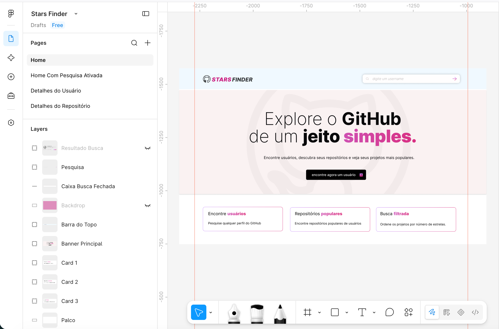
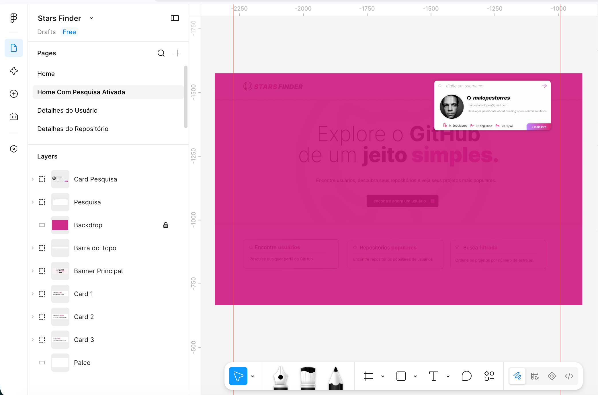
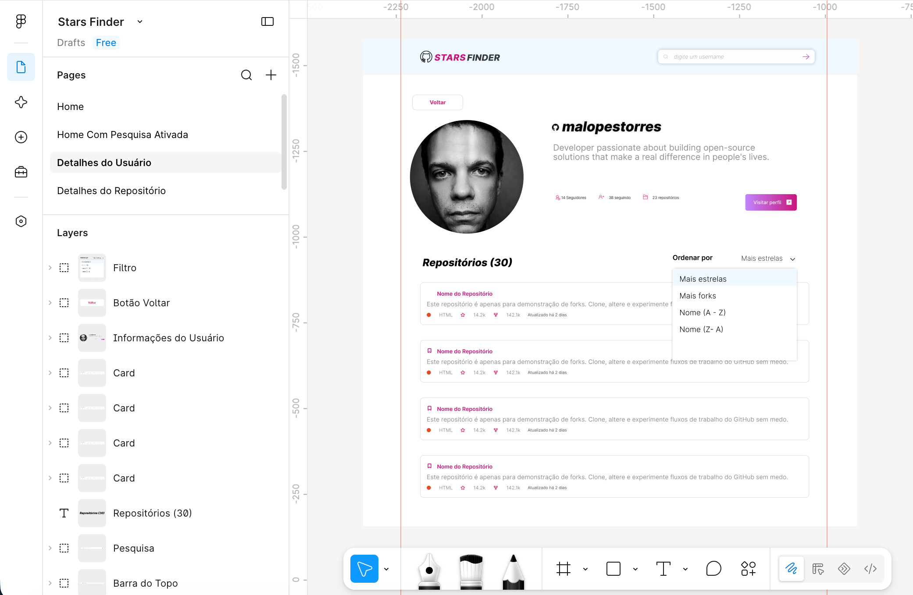
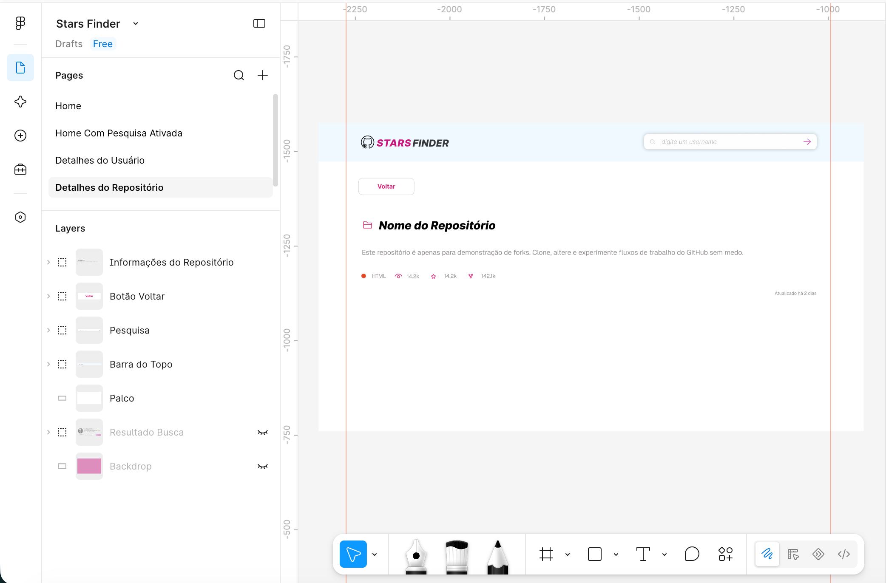

<div align="center">
  
  <h2>Stars Finder</h2>
  <p>Aplicação para busca de usuários do GitHub. <br>Encontre usuários, descubra seus repositórios e veja seus projetos mais populares.</p>
  <p><a href="https://starsfinder.vercel.app">DEMO</a></p>
</div>

---

## Screenshots

<div align="center">
  <div style="display: flex; flex-wrap: wrap; justify-content: center; gap: 10px;">
    
    
    
    
  </div>
</div>

---

## Tecnologias

- **Next.js 16 (App Router)** 
- **React 19** 
- **TypeScript**
- **Bootstrap 5 & CSS** 
- **Axios** 
- **Vitest & React Testing Library** 
- **Vercel**

---

## Instalação e Execução

- Node.js (versão 20 ou superior)
- npm

### Passos

1. Clonar repositório:
```bash
git clone https://github.com/malopestorres/stars-finder.git
cd stars-finder
```

2. Instalar  dependências:
```bash
pnpm install
```

3. Configurar  variáveis de ambiente

4. Iniciar  servidor de desenvolvimento:
```bash
pnpm dev
```

A aplicação estará disponível em `http://localhost:3000`.

5. Para rodar testes:
```bash
pnpm test
```

6. Para build:
```bash
pnpm build
pnpm start
```

---

## Configuração de Token GitHub

Para obter os dados da api corretamente, inclusive o email do usuário pesquisado é necessário usar a versão autenticada da api.

### Como gerar token:
1. Acesse sua conta no GitHub e vá para **Settings** > **Developer settings** > **Personal access tokens** > **Fine-grained tokens** ou acesse [https://github.com/settings/tokens](https://github.com/settings/tokens).
2. Clique em **Generate new token (fine-grained)**.
3. Defina um nome e um prazo de expiração
4. Clique em **Generate token** e copie o código gerado.

### Onde configurar:
Crie o arquivo `.env.local` na raiz do projeto com as seguintes variáveis:

```env
GITHUB_TOKEN=seu_token_aqui
API_GITHUB_URL=https://api.github.com
```

---

## Rotas da Aplicação

- `/`
  Página inicial (Home). Contém o banner principal com cta e formulário de busca de usuários com feedback em tempo real e visualização prévia do perfil.

- `/[username]`
  Página de perfil do usuário. Exibe os dados do perfil (avatar, nome, bio, seguidores, seguindo, quantidade de repositórios) e  listagem dos repositórios públicos ordenáveis por estrelas, forks e ordem alfabética.

- `/[username]/repo/[repository]`
  Página de detalhes do repositório específico. Exibe os dados do repositório (estrelas, forks, observadores, linguagem, data de última atualização), descrição completa e link de acesso direto ao repositório.

- `/api/users/[username]`
  Rota interna de API. Atua como backend intermediário para consulta dos dados do usuário na API do GitHub.

---

## Casos de Uso Cobertos nos Testes

### CardRepositoryDetail
- deve renderizar todos os dados do repositório retornados pela API
- não deve renderizar descrição nem linguagem quando forem nulos

### CardSearchUser
- deve aparecer ao carregar a rota as informacões referentes ao usuário pesquisado (seguidores, seguidos, avatar, email, bio e botão de visitar perfil)

### Header
- deve aparecer um card com as informacões referentes ao usuário pesquisado (seguidores, seguidos, avatar, email e bio)
- deve navegar para a página do usuário ao clicar no botão de mais informações

### NotFound
- deve renderizar o ícone, o texto e o botão de voltar

### RepoList
- deve renderizar a quantidade correta de repositórios
- deve aparecer as informações referentes ao repositório do usuário pesquisado (stars, forks, data e linguagem opcional)
- deve exibir link que direciona para rota do repositório
- deve exibir link externo que direciona para repositório no GitHub

### SortDropdown
- deve abrir o menu ao clicar no botão e listar opções
- deve disparar onSelect com a opção correta ao clicar em um item

### StatusItem
- deve renderizar ícone e texto corretamente
- deve renderizar indicador de cor quando informado

---

## Otimizações Gerais e de Performance

- **Rota 404**: Utilização de rota 404 para exibição de mensagem clara sobre usuário ou repositório não encontrado. Ex: [https://starsfinder.vercel.app/rota-inexistente](https://starsfinder.vercel.app/rota-inexistente)
- **useMemo e useCallback**: Utilizados para memoizar cálculos de ordenação de listas de repositórios e eventos, evitando renderizações desnecessárias e recálculos a cada nova renderização do componente.
- **Context API (SearchContext)**: Comunicação entre componentes distantes (como o botão de ação no Banner e o campo de busca no Header).
- **Prefetch de Rotas**: Pré-carregamento de páginas no evento de hover de links e cards de repositórios utilizando `next/link` e `router.prefetch`.
- **ISR (Incremental Static Regeneration)**: Configuração de revalidação periódica (`revalidate = 60`) em rotas estáticas para geração de páginas com cache.
- **Prevenção de FOUC (Flash of Unstyled Content)**: O FOUC acontece quando o navegador renderiza o HTML antes que os estilos estejam carregados, causando um flash momentâneo no conteúdo.


---

## Trade-offs e Decisões de Arquitetura

- **Limite de 100 repositórios**: A API pública do GitHub impõe limite de 100 itens por página (`per_page=100`). Optei por limitar a listagem inicial a esse limite com ordenação por estrelas, sem implementar paginação.
- **Ausência de Skeletons e Suspense**: A aplicação prioriza Server Components e pré-render com SSR/ISR, Essa abordagem reduziu a complexidade de manutenção e manteve o build mais enxuto.
